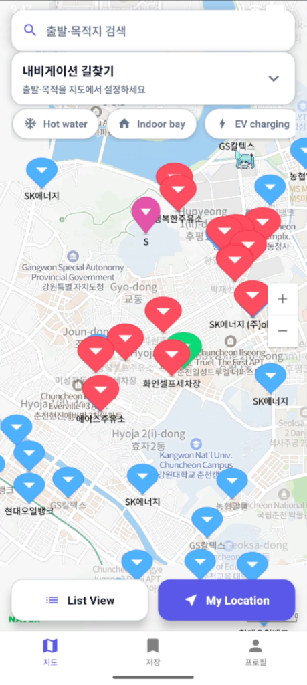
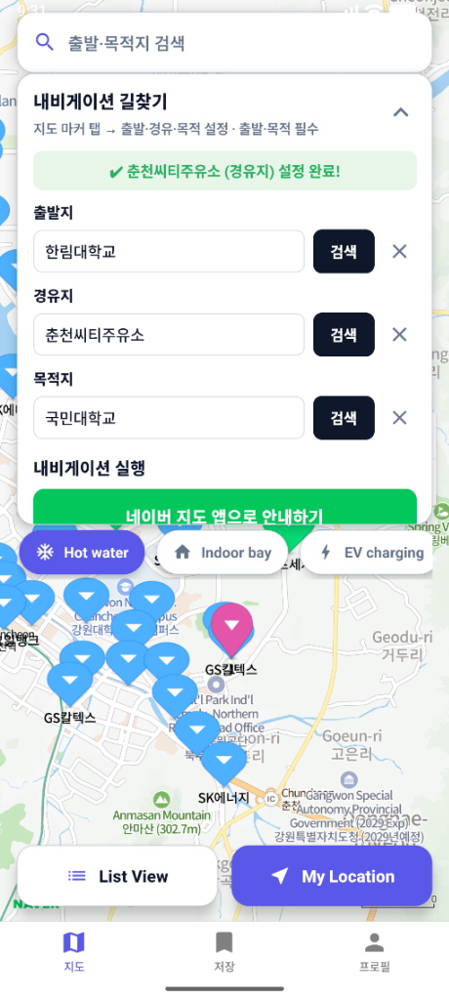
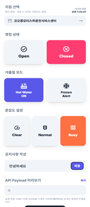
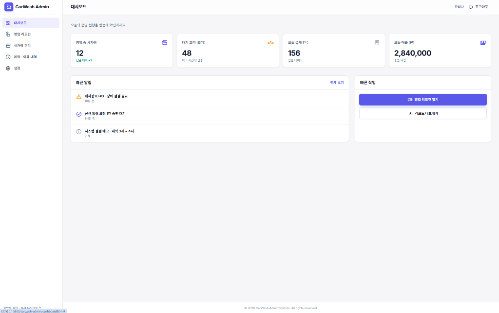

# 🗺️ Mapping: 실시간 세차장 운영 플랫폼
> **"생활 속 불편함을 해결한다."**  
> 실시간 세차장 상태(동파, 온수, 혼잡도) 정보 제공 및 외부 네비게이션 연동 경유지 설정 서비스.

<p align="center">
  
  
  
  
  
</p>

---

## 🔍 프로젝트 개요 (Overview)

겨울철 세차를 결심하고 세차장에 방문했다가 **동파로 인한 휴업, 긴 대기열**로 인해 발걸음을 돌려보신 적이 있으신가요?  
기존의 지도 서비스들은 세차장의 고정적인 위치와 영업 시간 정보는 제공하지만, **현재 온수가 나오는지, 동파로 인해 문을 닫았는지, 혹은 현재 얼마나 혼잡한지**와 같은 실시간 운영 상태를 제공하지 못합니다.

**Mapping**은 이와 같은 생활 속 불편함을 해결하기 위해 기획된 **실시간 양방향 세차장 정보 플랫폼**입니다.
* **사용자**는 실시간으로 업데이트되는 세차장의 상세 상태(동파 여부, 온수 공급, 대기 혼잡도 등)를 파악하고 최적의 경로 상에 있는 세차장을 경유지로 설정하여 안내받을 수 있습니다.
* **세차장 업주**는 모바일 리모컨 및 대시보드 웹을 통해 터치 한 번으로 현재 세차장 상태를 실시간으로 고객들에게 공유할 수 있습니다.

---

## ✨ 핵심 기능 (Key Features)

### 📱 사용자 앱 (React Native)
* **네이버 지도 기반 실시간 세차장 렌더링**
  * `mjstudio`의 NaverMap 호환 패키지를 도입하여 지도 위에 실시간 마커 및 UI 시각화.
  * 온수 작동 여부, 실내 베이(Indoor Bay) 유무, 전기차(EV) 충전 가동 여부 등 세부 필터 제공.
* **최적화된 목적지 키워드 검색**
  * 모바일 앱 내부의 리소스 무게를 덜기 위해 외부 API 직접 탑재 대신 **자체 서브 백엔드 서버(API)**를 통해 키워드 검색을 가볍게 수행.
* **외부 네비게이션 앱과의 유연한 연결 (URL Scheme)**
  * 무겁고 불안정한 자체 경로 안내 기능 대신, 사용자가 평소 사용하는 친숙한 네비게이션 앱(네이버 지도, 카카오맵, 티맵 등)으로 즉시 연결하여 **세차장을 경유지로 포함한 경로 안내** 실행.

### 📊 업주용 관리자 대시보드 & 리모컨 (CarWash Admin)
* **실시간 대시보드**
  * 운영 중인 지점 현황, 총 대기 고객 수, 오늘의 결제 건수 및 실시간 매출(원) 모니터링.
* **영업 조작 리모컨**
  * **영업 상태**: Open / Closed 스위칭
  * **겨울철 모드**: 온수 공급(Hot Water ON) / 동파 경보(Frozen Alert) 활성화
  * **혼잡도 설정**: 쾌적(Clear) / 보통(Normal) / 혼잡(Busy) 3단계 간편 조절
  * **공지사항 작성**: 실시간 수정 사항 및 안내글 작성 시 즉각 사용자 앱에 반영.

## 📱 서비스 화면 (Screenshots)

<table align="center">
  <tr>
    <td align="center"><b>📱 세차장 실시간 지도</b></td>
    <td align="center"><b>📱 내비게이션 경유지 설정</b></td>
    <td align="center"><b>📱 업주용 모바일 리모컨</b></td>
  </tr>
  <tr>
    <td align="center"></td>
    <td align="center"></td>
    <td align="center"></td>
  </tr>
</table>

<table align="center">
  <tr>
    <td align="center"><b>🖥️ 업주용 PC 관리자 대시보드 웹</b></td>
  </tr>
  <tr>
    <td align="center"></td>
  </tr>
</table>

---

## 🛠️ 기술 스택 (Tech Stack)

### Frontend (User App)
* **React Native** (v0.84.1), TypeScript, React Navigation (v7)
* `@mj-studio/react-native-naver-map` (네이버 지도 연동)
* `@gorhom/bottom-sheet` (바텀 시트 UI 및 상세 정보 컴포넌트)
* `react-native-reanimated` (부드러운 애니메이션 및 인터랙션)
* `@supabase/supabase-js` (실시간 세차장 DB 동기화)

### Backend & Database
* **Express & Node.js** (API 라우팅 및 데이터 중계 서버)
* **Supabase** (PostgreSQL, Realtime DB 연동, 사용자 정보 관리)
* **Vercel** (서브 백엔드 서버 배포)
* **External APIs**:
  * 카카오 키워드 검색 API (검색 키 노출 대비 이중화 설계)
  * 한국환경공단 EV 충전소 공공데이터 API (지역/시간 단위 동기화)
  * Opinet 유가 API (일 1회 동기화)

### Admin Web
* HTML5, Vanilla CSS, JavaScript, Service Worker (PWA 지원)


---


## 📁 프로젝트 폴더 구조 (Project Directory)

```bash
Carwawsh_Capston/
├── backend/              # Node.js/Express 기반 서브 백엔드 서버
│   ├── index.js          # 공공 API 중계 및 외부 데이터 동기화 로직
│   └── package.json
├── carwash-admin/        # 업주 전용 실시간 리모컨 & 대시보드 웹 (HTML/JS)
│   ├── index.html        # 관리자 로그인 페이지
│   ├── dashboard.html    # 매출 및 통계 대시보드
│   └── remote.html       # 실시간 상태 변경 리모컨 페이지
├── frontend/             # React Native CLI 기반 사용자 모바일 애플리케이션
│   ├── App.tsx           # 메인 애플리케이션 진입점
│   ├── android/          # 안드로이드 네이티브 빌드 파일
│   ├── ios/              # iOS 네이티브 빌드 파일
│   └── package.json
└── database/             # Supabase / DB 스키마 및 마이그레이션 백업 자료
```

---

## 📍 실행 전 주의사항 (Prerequisites)

### 🤖 Android 실행 환경 설정
1. 이 프로젝트는 **React Native CLI** 기반으로 동작합니다.
2. 구글 맵 및 지도 연동을 위해 다음 파일에 본인의 API Key를 수동으로 입력해야 정상 작동합니다.
   * **설정 경로**: `frontend/android/app/src/main/AndroidManifest.xml`
   * **수정 대상**: `com.google.android.geo.API_KEY`
   > ⚠️ **주의**: API 키가 누락되거나 유효하지 않은 경우, 앱 실행 직후 비정상 종료(Crash)될 수 있습니다.

---

## 🚀 시작 가이드 (Getting Started)

### 1. 서브 백엔드 서버 (Backend) 실행
```bash
cd backend
npm install
node index.js
```
* 포트 설정 및 API 키 바인딩을 위해 `.env` 파일에 환경 변수(Supabase URL, Kakao Key 등)를 구성해야 합니다.

### 2. 사용자 모바일 앱 (Frontend) 실행
```bash
cd frontend
npm install

# Android 빌드 및 실행
npm run android

# iOS 빌드 및 실행
npm run ios
```

### 3. 관리자 웹 (Admin Dashboard) 실행
* `carwash-admin/` 디렉터리의 `index.html` 파일을 로컬 브라우저에서 열거나 로컬 웹 서버(예: Live Server)를 통해 실행할 수 있습니다.

---

## 📈 비즈니스 모델 및 시장 전략 (Business Model & Strategy)

1. **BMC (Business Model Canvas) 기반 구성**
   * **핵심 가치**: 동파 방지 모드 제공, 낭비되는 대기 시간 최소화, 온수 가동 확인 등 맞춤형 인포메이션 제공.
   * **B2B 서비스**: 세차용품 제조사 제휴 광고, 예약 결제 수수료, SaaS 기반 세차장 관리 통합 솔루션 제공.
2. **저비용 구독 모델 (대 구독 시대)**
   * Opinet, 카카오맵 검색 API, EV 공공 API 등 무료 트래픽 구간을 효율적으로 연동하고 이중화하여 **서버 유지 관리 비용을 최소화**.
   * 이를 통해 업주들의 진입 장벽을 낮추어 **낮은 구독료 모델**로 빠르게 고객사 및 파트너사를 확보합니다.
3. **슈퍼앱(Super App) 생태계 편입**
   * 독립적인 단독 앱 설치 허들을 극복하기 위해 궁극적으로는 **카카오 T, 토스(Toss), 위챗(WeChat)** 등 친숙한 슈퍼앱의 미니 프로그램/미니앱 형태로 연동·편입되는 방향성을 제시합니다.

---
* **한림대학교 정보과학대학 캡스톤 디자인 프로젝트**
* **개발자**: 김성호 (발표자), 하태영, 박시환

---
<sub>※ 본 프로젝트는 보안 및 키 유출 방지를 위해 소스코드 내 모든 API Key, Database Endpoint 및 인증 Credential이 제거되거나 무효화 처리되어 있습니다. 이에 따라 별도의 로컬 환경 변수(.env) 구성 및 개별 API Key 발급 설정 없이는 실제 구동이 제한될 수 있습니다.</sub>
